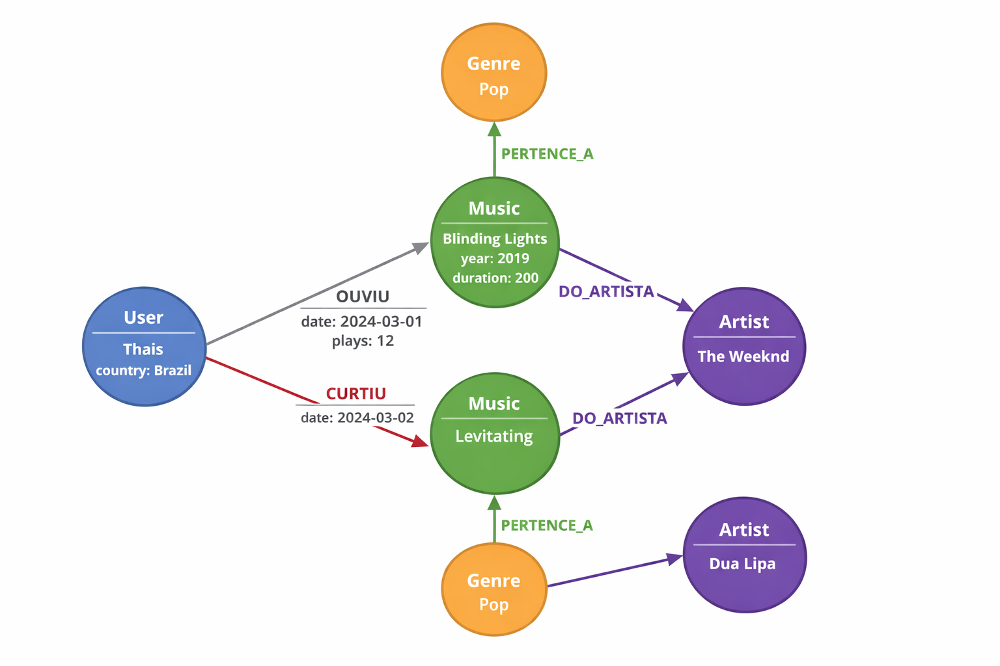

# 🎧 Criando um Algoritmo de Recomendação de Músicas com Grafos (Neo4j)

## 📌 Sobre o Projeto

Este projeto demonstra como utilizar **bancos de dados em grafos com Neo4j** para construir um **sistema simples de recomendação de músicas** baseado em relacionamentos entre usuários, músicas, artistas e gêneros.

Diferente de bancos relacionais tradicionais, os grafos permitem identificar **padrões de conexão entre entidades**, possibilitando recomendações mais naturais e eficientes.

Neste projeto, modelamos um pequeno ecossistema de streaming musical onde usuários interagem com músicas, artistas e gêneros.

---

# 🎯 Objetivo

Criar um modelo de dados em grafo capaz de:

* Representar usuários e seus gostos musicais
* Conectar músicas a artistas e gêneros
* Identificar usuários com gostos semelhantes
* Gerar **recomendações de músicas** baseadas nessas conexões

---

# 🧠 Por que utilizar Grafos?

Bancos de dados em grafos são ideais para sistemas de recomendação porque trabalham diretamente com **relações entre dados**.

Exemplos de aplicações:

* Spotify
* Netflix
* Amazon
* Sistemas de fraude financeira

No caso deste projeto, o grafo permite descobrir recomendações como:

> "Usuários que ouviram as mesmas músicas que você também ouviram..."

---

# 🧩 Modelo do Grafo

### Nós (Entidades)

* **User** → Usuários da plataforma
* **Music** → Músicas disponíveis
* **Artist** → Artistas
* **Genre** → Gêneros musicais

### Relacionamentos

| Relacionamento | Descrição                    |
| -------------- | ---------------------------- |
| OUVIU          | Usuário ouviu uma música     |
| CURTIU         | Usuário curtiu uma música    |
| DO_ARTISTA     | Música pertence a um artista |
| PERTENCE_A     | Música pertence a um gênero  |

---

# 🔗 Estrutura do Grafo

```
(User)-[:OUVIU]->(Music)
(User)-[:CURTIU]->(Music)
(Music)-[:DO_ARTISTA]->(Artist)
(Music)-[:PERTENCE_A]->(Genre)
```

Imagem do modelo:

```

```

---

# 📂 Estrutura do Repositório

recomendacao-musicas-grafos

dataset/
musicas.csv

queries/
criar-grafo.cypher
importar-dados.cypher
recomendacoes.cypher

images/
modelo-grafo.png
exemplo-recomendacao.png
```

---

# 📊 Dataset de Exemplo

Arquivo:

```
dataset/musicas.csv
```

Exemplo de dados:

```
user,music,artist,genre
Thais,Blinding Lights,The Weeknd,Pop
Thais,Levitating,Dua Lipa,Pop
Joao,Levitating,Dua Lipa,Pop
Joao,Shape of You,Ed Sheeran,Pop
Maria,Smells Like Teen Spirit,Nirvana,Rock
```

---

# ⚙️ Importação de Dados

Exemplo utilizando **LOAD CSV** no Neo4j.

```cypher
LOAD CSV WITH HEADERS FROM 'file:///musicas.csv' AS row

MERGE (u:User {name: row.user})
MERGE (m:Music {title: row.music})
MERGE (a:Artist {name: row.artist})
MERGE (g:Genre {name: row.genre})

MERGE (u)-[:OUVIU]->(m)
MERGE (m)-[:DO_ARTISTA]->(a)
MERGE (m)-[:PERTENCE_A]->(g)
```

---

# 🤖 Algoritmo de Recomendação

## 1️⃣ Recomendação por gênero

Sugere músicas do mesmo gênero que o usuário já ouviu.

```cypher
MATCH (u:User {name:"Thais"})-[:OUVIU]->(m:Music)-[:PERTENCE_A]->(g:Genre)
MATCH (recomendada:Music)-[:PERTENCE_A]->(g)

WHERE NOT (u)-[:OUVIU]->(recomendada)

RETURN recomendada.title
```

---

## 2️⃣ Recomendação baseada em usuários similares

Encontra usuários com gostos parecidos e recomenda músicas que eles ouviram.

```cypher
MATCH (u1:User)-[:OUVIU]->(m:Music)<-[:OUVIU]-(u2:User)
WHERE u1.name = "Thais"

MATCH (u2)-[:OUVIU]->(recomendada:Music)

WHERE NOT (u1)-[:OUVIU]->(recomendada)

RETURN recomendada.title, count(*) AS relevancia
ORDER BY relevancia DESC
```

---

# 📈 Exemplos de Insights do Grafo

O modelo permite responder perguntas como:

* Quais músicas devo recomendar para um usuário?
* Quais usuários possuem gosto musical semelhante?
* Quais gêneros são mais populares?
* Quais artistas conectam mais usuários?

---

# 🛠️ Tecnologias Utilizadas

* Neo4j
* Cypher Query Language
* Arrows.app (modelagem do grafo)
* GitHub

---

# 🚀 Como Executar o Projeto

1️⃣ Instalar o **Neo4j Desktop**
2️⃣ Criar um novo banco de dados
3️⃣ Importar o dataset localizado na pasta `dataset`
4️⃣ Executar os scripts da pasta `queries`

---

# 📚 Referências

* Documentação oficial Neo4j
* Exemplos de grafos da comunidade
* Plataforma DIO

---

# 👩‍💻 Autor

Projeto desenvolvido como parte dos estudos sobre **Banco de Dados em Grafos e Neo4j**.
